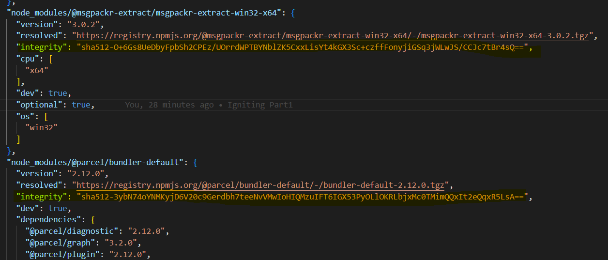

## Q: What is `npm`?
ANS: 


## Q: How to initialize `npm`?
ANS:
```
npm init
```
`npm init -y` can be used to skip the setup step, `npm` takes care of it and creates the `package.json` json file automatically , but without configurations.
- `npm` is the command line client that allows developers to install and publish those packages.


## Q: What are `bundlers`?
ANS: A bundler is a tool that takes your JavaScript, CSS, and other assets, and packages them together into optimized bundles that are ready to be served to your users’ browsers.

### Why are Bundlers Important in React?`
1. `Code Modularization`: React encourages a modular approach to building web applications. Developers break down their code into smaller, reusable components. Bundlers allow you to manage these components efficiently. They help in organizing your codebase, ensuring that only the necessary code is delivered to the client, reducing load times.

2. `Performance Optimization`: One of the key functions of a bundler is code optimization. Bundlers can perform minification, tree shaking, and dead code elimination. This means that only the essential code is bundled, resulting in smaller file sizes and faster load times for your application.

3. `Dependency Management`: React applications often rely on various external libraries and packages. Bundlers help manage these dependencies by bundling them alongside your code. This avoids conflicts, ensures version consistency, and simplifies deployment.

4. `Dynamic Imports`: Modern web applications often use dynamic imports to load code chunks on demand. Bundlers enable this by splitting your code into smaller chunks and loading them as needed, improving the initial page load speed.

5. `Development Workflow`: Bundlers are integrated into the development workflow, offering features like hot module replacement (HMR). HMR allows developers to see changes in real-time without the need for a full page refresh, significantly speeding up development and debugging.

6. `Browser Compatibility`: Bundlers can transform your code to be compatible with various browsers by using tools like Babel. This ensures that your React code runs smoothly on older browsers and provides a consistent experience for all users.

`Popular Bundlers in the React Ecosystem` ->
1. Webpack: Webpack is one of the most popular bundlers in the React ecosystem. It offers a highly configurable and extensible build process and is widely adopted in the React community.
2. Parcel: Parcel is known for its ease of use and zero-config approach. It’s an excellent choice for smaller projects or developers who prefer a simpler setup.


## Q: What is `Parcel/Webpack`? Why do we need it?
ANS: `Parcel` and `webpack` are the bundlers used mostly for `JavaScript` or `Typescript` code that helps you to `minify, clean, and make your code compact` so that it becomes easier to send a request or receive the response from the server when it usually takes you to transfer multiple files without using any bundler for loading the page of your application. Both of these bundlers substantially reduce the time it takes for the transfer of data and files to the server from the application. Along with that both bundlers parcel and webpack remove the unnecessary comments, new lines, any kind of block delimiters, and white spaces while the functionality of the code remains unchanged.

Use of `Parcel/Webpack`:
Module bundlers are the way to organize and combine many files of JavaScript code into one file. A JavaScript bundler can be used when your project becomes too large for a single file or when you're working with libraries that have multiple dependencies.

### installation commands:

- Install:

```
npm install -D parcel
```

`-D` is used for development and as a development dependency.

- Parcel Commands :
  - For development build:
  ```
  npx parcel <entry_point>
  ```
  - For production build :
  ```
  npx parcel build <entry_point>
  ```

## Q: Difference between `package.json` and `package-lock.json`?
ANS: 
## 1. package.json:
- `Purpose`: package.json is a manifest file that contains metadata about the project, including its name, version, description, entry points, scripts, dependencies, and more.

- `Usage`: Developers manually edit package.json to add, remove, or update dependencies, specify scripts for tasks like building or testing, and provide general information about the project.

- `Dependency Listing`: It lists the packages required for the project to run (dependencies), as well as those needed only during development and testing (devDependencies). However, it doesn't specify exact version numbers.

## 2. package-lock.json:
- `Purpose`: It is  automatically generated by npm (Node Package Manager) that serves as a record of the exact versions of all installed packages and their dependencies. It was introduced to address the problem of dependency versioning and to ensure that all developers working on a project are using the same versions of packages.

- `Usage`: 
  - `Version Locking`: It locks down the versions of all installed dependencies, including their transitive dependencies. This ensures that every time you run npm install, you get the exact same versions of packages installed, regardless of any updates that might have been released since the last install.
  - `Dependency Tree`: It contains a complete dependency tree of all installed packages, along with their resolved versions. This ensures that npm can recreate the exact dependency tree when someone else installs the dependencies for the project.
  - `Integrity Check`: It includes a cryptographic hash of the contents of each installed package, ensuring that the package contents haven't been tampered with since they were originally published to the npm registry. This enhances the security of the project by preventing unauthorized modifications to dependencies.


## What is `integrity` in package-lock.json?
ANS: In package-lock.json, the "integrity" field provides a crucial security measure by ensuring the integrity and authenticity of the installed packages.

Here's what it does:

`Cryptographic Hashing`: The "integrity" field contains a cryptographic hash (usually a SHA-512 hash) of the package contents. This hash is computed based on the package's files and metadata at the time of installation.

`Preventing Tampering`: When npm installs a package, it calculates the integrity hash of the downloaded package and compares it to the hash stored in package-lock.json. If the hashes don't match, it indicates that the package has been tampered with or modified since it was published to the npm registry.

`Enhanced Security`: By including integrity checks, package-lock.json helps prevent attackers from injecting malicious code into packages during installation. Even if a package's metadata or version is compromised, the integrity check ensures that the package contents remain unchanged.



## What are `transitive dependencies`?
ANS: Transitive dependencies are dependencies that are required by your project's direct dependencies. In other words, if your project depends on package A, and package A depends on package B, then package B is a transitive dependency of your project.


## Q: What is `.gitignore`?
ANS: A `.gitignore` file is a configuration file used by Git to specify intentionally untracked files that Git should ignore. These files are typically files generated by the build process or other temporary or generated files that you don't want to be included in version control. By specifying these files in .gitignore, you can keep your repository clean and focused on the source code and essential project files.

File and Directory Patterns: You can specify individual files, directories, or patterns to ignore. For example:
- `node_modules/` ignores the entire node_modules directory.
- `*.log` ignores all files with the .log extension.
- `build/` ignores the build directory.

## Q: Difference between `npm` and `npx`?
ANS: `npm` is the package manager for Node.js and JavaScript. It is used to install, manage, and publish packages (libraries or tools) for Node.js projects. Eg= npm install: Installs dependencies listed in package.json.

`npx` is a package runner tool that comes bundled with npm (since npm 5.2.0). It is used to execute packages from the npm registry or locally-installed executables. Eg= npx <package>: Executes a package directly from the npm registry.


## Q: What is Tree Shaking? in Parcel?

ANS: `Tree shaking`, also known as `dead code elimination`, is the practice of `removing unused code in your production build`. It's important to ship as little code to your end-users as possible. By statically analyzing our source code, we can determine what's not being used and exclude it from our final bundle.


## Q: What is Hot Module Replacement?

ANS: `Hot Module Replacement (HMR)` exchanges, adds, or removes modules while an application is running, without a full reload. This can significantly speed up development in a few ways: Retain application state which is lost during a full reload. Save valuable development time by only updating what's changed.

## Q: List down your favourite 5 superpowers of Parcel and describe any 3 of them in your own words.
ANS:
### Parcel features:
- Dev Build - parcel provides us develop build
- Local Server - parcel also provides us a local server, which can be used to see live changes in our application.
- HMR = Hot Module Replacement - exchanges, adds, or removes modules while an application is running, without a full reload

and some of more cool features of Parcel are:

- File Watching Algorithm - written in C++
- Caching - Faster Builds
- Image Optimization
- Minification
- Bundling
- Compress
- Consistent Hashing
- Code Splitting
- Differential Bundling - support older browsers
- Diagnostic
- Error Handling
- HTTPs
- Tree Shaking - remove unused code
- Different Build for dev and prod bundles


## Q: What is `browserlists`?
ANS: Browserslist is a configuration tool used to specify the list of target browsers that we want our web project to support. It's commonly used in conjunction with various front-end development tools like Autoprefixer, Babel, and stylelint.

Here's a breakdown of its key features and usage:

- Target Browser Configuration: Browserslist allows you to define a list of target browsers using queries such as specific browser versions, usage statistics, or broader categories like "last 2 versions" or "> 1%".
- Integration with Build Tools: Browserslist is often integrated into build tools like Babel for JavaScript transpilation, Autoprefixer for CSS vendor prefixing, and other tools to ensure that the generated code is compatible with the specified browsers.
- CLI Support: Browserslist provides a command-line interface (CLI) that allows you to query the list of target browsers specified in your project's configuration. This can be useful for debugging or checking the compatibility of your code with the target browsers.
- Configuration Flexibility: You can define your target browsers in various ways, either through a dedicated configuration file (such as .browserslistrc or browserslist.config.js) or directly in your package.json file.
- Support for Usage Data: Browserslist can take into account global usage statistics to determine which browsers are commonly used by your target audience. This helps ensure that your project is optimized for the browsers most commonly used by your users.


## Q: What is the `dist` folder?
ANS: In Parcel, the "dist" folder is the default output directory where your production-ready, optimized, and bundled files are placed after building your React.js website.

When you run the Parcel build command for your React.js project, Parcel analyzes your project's dependencies, compiles your JavaScript, CSS, and other assets, and then outputs the resulting bundled files into the "dist" folder by default.

 We can now deploy the contents of the "dist" folder to our web server or hosting service to make our React.js website available to users.

## Q: What is `.parcel-cache` in parcel?
ANS: The .parcel-cache directory in Parcel is where Parcel stores cached data to speed up subsequent builds of your project. Parcel uses caching to avoid recompiling and processing files that haven't changed since the last build, thus improving build performance.

Here's what you need to know about .parcel-cache:

- Cache Directory: .parcel-cache is a hidden directory that Parcel creates in your project's root directory when it processes files during builds.
- Cached Data: Parcel stores various kinds of data in the cache, including parsed ASTs (Abstract Syntax Trees) of JavaScript and CSS files, dependency graphs, and compiled assets.
- Improves Build Performance: By caching previously processed data, Parcel avoids reprocessing files that haven't changed since the last build. This can significantly speed up subsequent builds, especially in large projects with many dependencies.
- Automatic Management: Parcel manages the cache automatically, so you typically don't need to interact with the .parcel-cache directory directly. Parcel will update and purge the cache as needed during builds.
- Version-specific: Each version of Parcel may use its own cache format. If you update Parcel to a new version, it may invalidate the existing cache and create a new one.
- Cache Invalidation: In some cases, such as when you modify certain configuration files or change dependencies, Parcel may invalidate the cache to ensure that it accurately reflects the current state of your project.